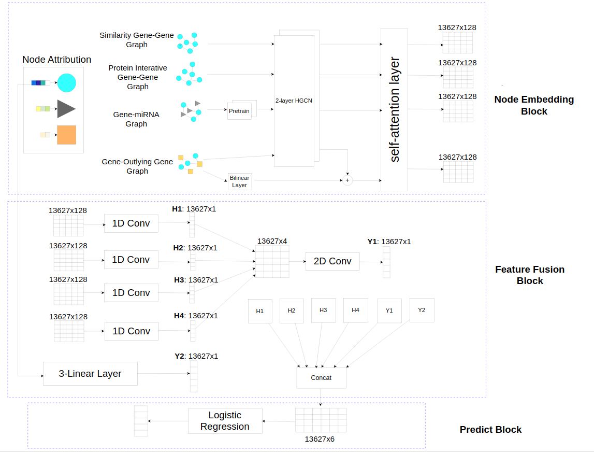

# Predicting Driver Genes using Graph Neural Network

Cancer is a dangerous and very complex disease, among which Lung Adenocarcinoma
is one of the most common cancers. Cancer, in general, is a disease that occurs
when genetic mutations appear in multiple genes. These gene mutations support
each other in the formation and development of tumors. Among the genetic mutations
found, there are mutations that are the main cause of tumor growth - these are called
Driver Mutations, and the genes affected by Driver Mutations are called Driver
Genes. Accurately identifying Driver Genes plays an important role in cancer treatment,
preventing tumors, and stopping the metastasis of tumors to other organs. Nowadays,
Driver Genes are only identified based on laboratory results, which are very time-
consuming and expensive. Therefore, many artificial intelligence models have been
developed to predict Driver Genes, but none have achieved high accuracy due
to not fully utilizing the characteristics of genes in the models. My idea is to
create a model to predict Driver Genes for Adenocarcinoma of the Lung, using
a Graph Neural Network to learn the characteristics of genes and their interactions
with related factors, and then using a classification model to predict these genes.
Through this project, I hope to make positive contributions to the detection of the
origins of lung adenocarcinoma development in particular and cancers in general,
opening up new prospects in the treatment of this dangerous disease.

The model consists of three main components.
1. Node Embedding Block: Digitize the vertices in the graph into vectors. 
2. Feature Fusion Block: Aggregate the vectors representing a vertex into a single vector.
3. Prediction Block: Make predictions based on the vector which is learned from Feature Fusion Block.

Here is the overall structure of the model.

<div style="text-align: center;">
    
    <p><em>Figure 1: The Overview of My Model</em></p>
</div>


## Table of Contents

- [Installation](#installation)
- [Folder Structure](#folder-structure)   
- [Usage](#usage)

## Installation

Install libraries and dependencies

```bash
conda env create -f enviroment.yml
conda active DNN
```

Download from https://drive.google.com/file/d/1Sp_YWtXQsKUCdYkbVHMfHnKjN-PF6bmL/view?usp=sharing and Express file zip
```bash
zip Similarity_maxtrix.zip ./data/luad/Similarity_matrix.csv
```

## Folder Structure

Project-final/   
├── data/   
│   ├── luad/   
│   └── pan-cancer/   
│   ├── miRNA_names.csv   
│   ├── Similarity_matrix.csv   
│   ├── 2187false.txt   
│   └── gene_names.txt   
├── Images/   
|── preprocessing.ipynb  
├── preProcessing/   
│   ├── gen_adj.py   
│   └── get_BA.py   
├── result/   
│── model_selection.ipynb   
│── plot.ipynb   
├── Readme.md   
├── load_data.py   
├── model_all.py   
├── model_ba.py   
├── model_other.py   
├── model_pretrain.py   
├── pretrain.py   
├── gen_Sim_PP.R   
└── enviroment.yml   

### Explanation
- **`data/luad`**: Data used for training   
- **`data/pan-cancer`**: Raw data needs to be processed   
- **`preprocessing.ipynb`**: Process raw data  
- **`preProcessing/gen_adj.py`**: Create a normalized adjacency matrix   
- **`preProcessing/get_BA.py`**: Prepare input for the Bilinear Model   
- **`resutl/`**: The obtained results   
- **`model_selection.ipynb`**: Select approriate models   
- **`plot.ipynb`**: Analyze experimental results   
- **`model_all`**: Contains the whole construction of model   
- **`model_ba`**: Bilinear Model   
- **`model_other`**: Feature Fusion Block   
- **`model_pretrain`**: Pretrain Model    
- **`gen_Sim_PP.R`**: Create the Similarity Gene - Gene Matrix   
- **`enviroment.yml`**: Contains libraries and dependencies   

## Usage
**To preprecessing**: Run preprocessing.ipynb  
**To pretrain**: python3 pretrain.py  
**To run model**: Run model_selection.ipynb  